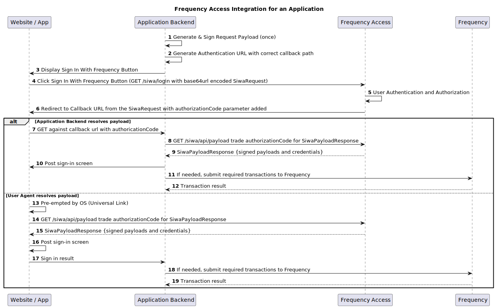

# Frequency Access Actions

Frequency Access handles three different situations for each user:

| Action            | Frequency Blockchain account (MSA) | Delegation with Your Application |
| ----------------- | ---------------------------------- | -------------------------------- |
| Create Account    | _Required_                         | _Required_                       |
| Create Delegation | Existing                           | _New or Updated Required_        |
| Login             | Existing                           | Existing                         |

## General Flow

1. Generate a new login request to Frequency Access ([See Details](./Request.md))
2. Have the user agent follow the location response
2. Receive a callback from Frequency Access
3. Retrieve and process the result from Frequency Access ([See Details](./Result.md))

### Sequence Diagram

## Backend Requirements

- Able to validate payloads from Frequency Access
- Able to connect to a Frequency RPC Node
- Able to sign transactions to submit to the Frequency RPC Node

{{#button-links}}
